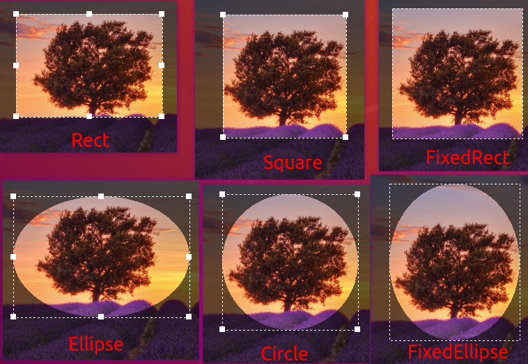
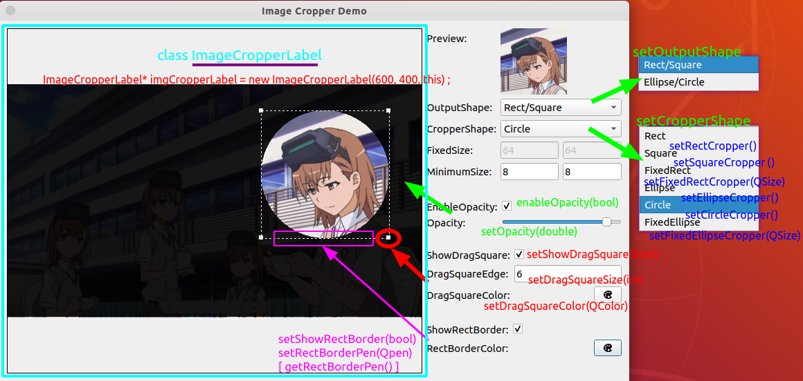
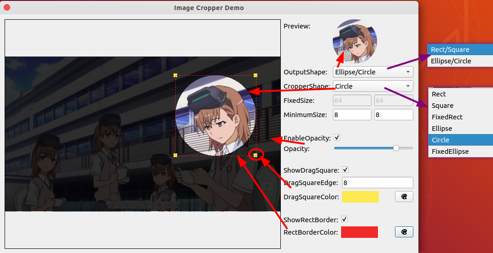
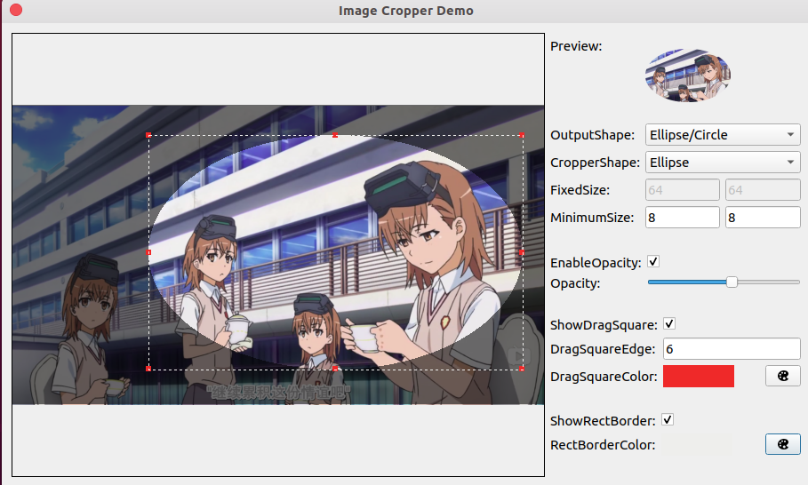
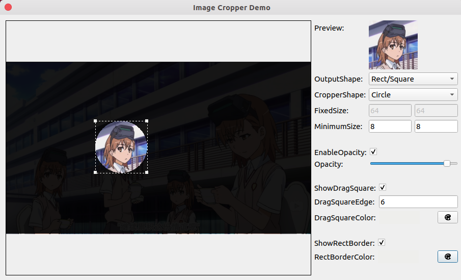
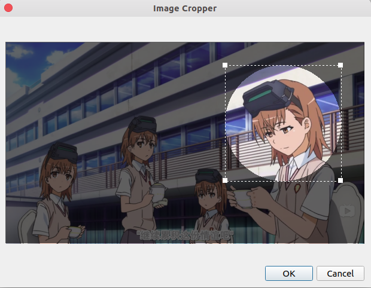
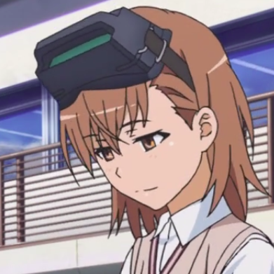

## \[C++\]\[Qt\] custom class : ImageCropperLabel

## 一、简介

一个图像裁剪控件，可以用于但不限于：用户头像的裁剪。

支持输出矩形(包括正方形)、椭圆形（包括圆形）图像。

```txt
├── base
│   ├── imagecropperdialog.h
│   ├── imagecropperlabel.cpp	    <======== source file
│   └── imagecropperlabel.h       <======== header file
└── example
    ├── imagecropperdemo.cpp
    ├── imagecropperdemo.h
    ├── main.cpp
    ├── mainwindow.cpp
    └── mainwindow.h
```

真正的类在`base/imagecropperlabel.h`文件中，（`base/imagecropperlabel.cpp`为类的实现文件），实际使用只需要用到这两个文件。

另外，`base/imagecropperdialog.h`文件实现了对该类的封装，只需如下一行代码即可弹出一个窗口，用户截取图像后，返回截取的图像。（见倒数第三张附图）

```C++
QPixmap image = ImageCropperDialog::getCroppedImage("test.png", 600, 400, CropperShape::CIRCLE);
```

类似于Qt自带的`QColorDialog::getColor(...)`

## 二、类中的主要方法

### 1. 构造函数

`ImageCropperLabel(int width, int height, QWidget* parent = nullptr);`

构造时必须提供该控件的固定大小，即width 和 height。

### 2. 设置原始图像

`void setOriginalImage(const QPixmap& pixmap);`

### 3. 设置 裁剪器 (形状和大小)

```C++
void setRectCropper();
void setSquareCropper();
void setEllipseCropper();
void setCircleCropper();
void setFixedRectCropper(QSize size);
void setFixedEllipseCropper(QSize size);

// Not recommended
void setCropper(CropperShape shape, QSize size); 
```



```C++
/*****************************************************************************
* Set cropper's fixed size (Only work for FIXED_RECT and FIXED_ELLIPSE)
*****************************************************************************/
void setCropperFixedSize(int fixedWidth, int fixedHeight);
void setCropperFixedWidth(int fixedWidht);
void setCropperFixedHeight(int fixedHeight);

/*****************************************************************************
* Set cropper's minimum size
* default: the twice of minimum of the edge lenght of drag square
*****************************************************************************/
void setCropperMinimumSize(int minWidth, int minHeight);
void setCropperMinimumWidth(int minWidth);
void setCropperMinimumHeight(int minHeight);
```

### 3. 某些效果的显示

> 下图左侧的就是一个 ImageCropperLabel 控件
>
> 这是一个Demo窗口，用于测试该控件，从右侧可以方便的调节各种参数
>
> 代码在 "example" 目录下



## 三、如何使用

```C++
QPixmap pixmap;
pixmap.load("test.png");

// 创建控件，并设置固定大小
ImageCropperLabel* imgCropperLabel = new ImageCropperLabel(600, 400, this);
// 设置（圆形）裁剪器
imgCropperLabel->setCircleCropper();
// 设置原始图像
imgCropperLabel->setOriginalImage(pixmap);
// 设置输出图像的形状
// OutputShape::RECT     --> 矩形（正方形）
// OutputShape::ELLIPSE  --> 椭圆形（圆形）
imgCropperLabel->setOutputShape(OutputShape::RECT);
// 启用不透明效果，裁剪区域外不透明显示（默认启用）
//imgCropperLabel->enableOpacity(true);
// 设置不透明度(0~1的浮点数)
imgCropperLabel->setOpacity(0.6);  // 默认: 0.6
// 显示四个角(四条边)上的矩形方块，用于捕获鼠标，调整裁剪器的大小（默认显示）
//imgCropperLabel->setShowDragSquareEdge(true);
// 设置四个角(四条边)上的矩形方块的大小，颜色
imgCropperLabel->setDragSquareEdge(8);	// 默认: 8
imgCropperLabel->setDragSquareColor(Qt::green);  // 默认: Qt::white

// ...

// SIGNAL：void croppedImageChagned()
// 用户调整裁剪区域时，会触发 croppedImageChanged() 信号
// 调用 getCroppedImage() 可以获取裁剪区域的图像

QPixmap resultImage = imgCropperLabel->getCroppedImage(/*OutputShape::RECT*/);
```

## 四、Screenshots












## END

<leopard.c@outlook.com>